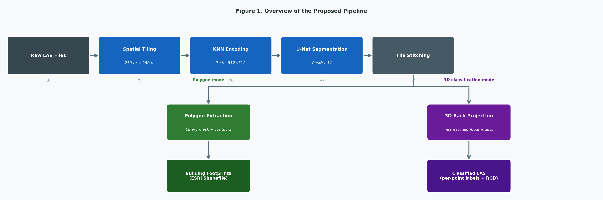
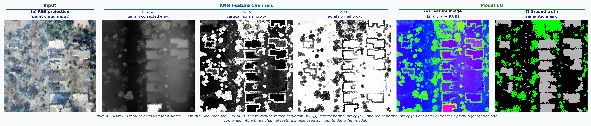
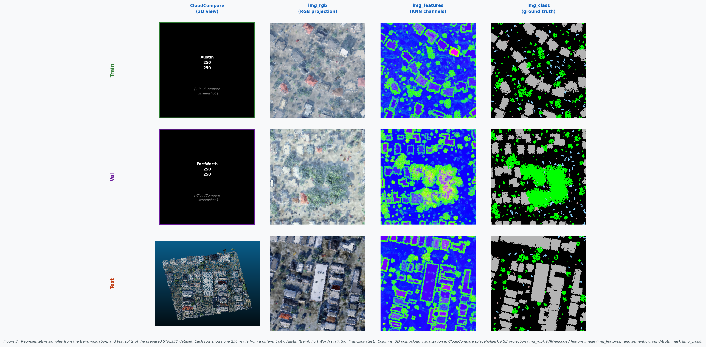
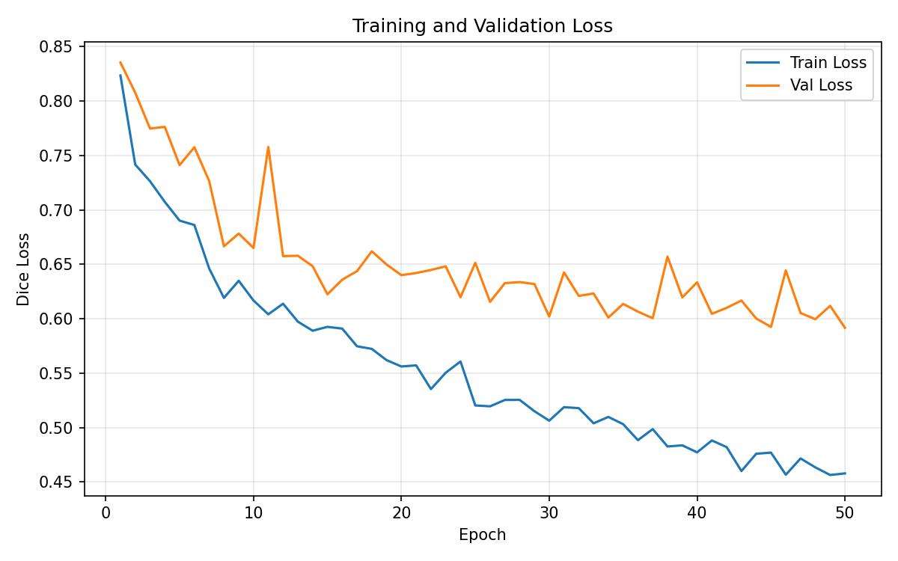
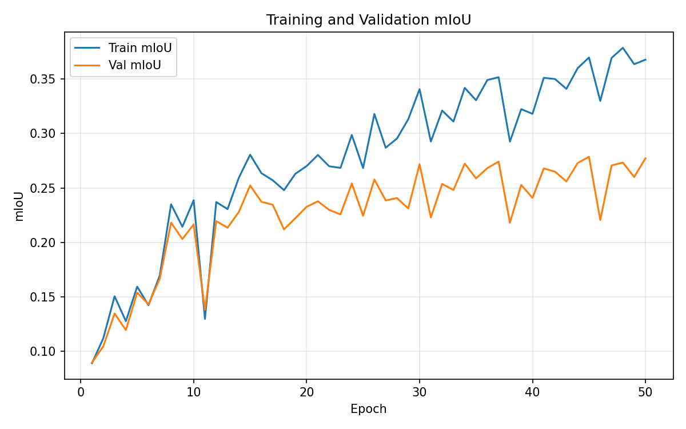
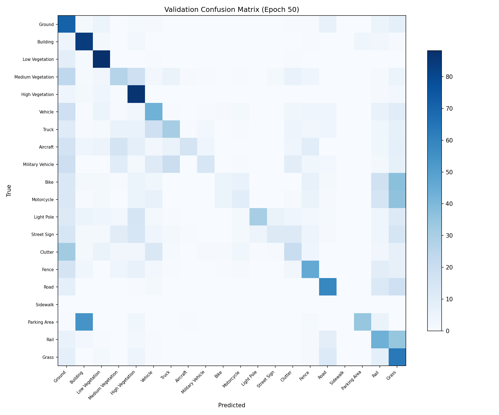

 ## 📋 DRAFT STATUS — TODO Tracker

> **v2 changes from v1:**
> - Fixed epoch number inconsistency (Section 4.2 → epoch 45 throughout)
> - Fixed figure numbering (pipeline=Fig 1, dataset=Fig 2, training curves=Fig 3, Malta feature maps=Fig 4, building seg=Fig 5, multiclass=Fig 6)
> - Fixed training dataset citation in Section 4.1 (STPLS3D → `@chen2022stpls3dapr`)
> - Restructured Table 2 to clearly separate SensatUrban baselines from STPLS3D results
> - Added KPConv original citation `@thomas2019kpconv` and RandLA-Net `@hu2020randlanet`
> - Added Duran/Atik 2022 (SegUNet3D) to Related Work — projection-based methods paragraph
> - Added Wang et al. 2023 (SMAnet) to Related Work — urban airborne LiDAR paragraph

| # | TODO Item | Type | Status | Comment |
|---|-----------|------|--------|---------|
| 1 | Confirm author order and emails | Admin | 🔴 Not done | Author names are present, but order/emails are not finalized. |
| 2 | Fill STPLS3D tile count (16 or 64) | Data | ✅ Done | Replaced with actual split: train 230 / val 50 / test 42 (total 322). |
| 3 | Add Malta dataset description (sizes, CRS) | Data | 🔴 Not done | Malta dataset metadata is still missing. |
| 4 | Fill hardware specs (GPU, CPU, RAM) | Data | ✅ Done | Hardware section includes Tesla T4, x86_64 CPU, and 12.7 GB RAM. |
| 5 | Run evaluation — fill all metric placeholders (mIoU, IoU, F1, Prec, Rec) | Experiment | 🟡 Partial | Core quality metrics are filled; runtime placeholders remain open. |
| 6 | Extract baseline numbers from SensatUrban paper | Literature | ✅ Done | Confirmed: baselines from Hu et al. 2021 Table 2 (SensatUrban). Table 2 restructured for clarity. |
| 7 | Measure runtime per tile / per scene | Experiment | 🔴 Not done | `[TIME_INFERENCE_PER_TILE_SEC]`, `[TIME_PIPELINE_PER_TILE_SEC]`, `[TIME_PER_SCENE_MIN]` still pending. |
| 8 | Generate per-class IoU table | Experiment | ✅ Done | Per-class IoU/F1 table included (best validation epoch 45). |
| 9 | Create Figure 1 — pipeline block diagram | Figure | ✅ Done | figure1_pipeline.png generated via matplotlib. |
| 10 | Create Figure 2 — feature encoding visualization (Section 3.3) | Figure | ✅ Done | figure_feature_encoding.png generated via matplotlib. |
| 11 | Create Figure 3 — dataset samples (Section 4.1) | Figure | 🟡 Partial | One sample shown; extend to 3×3 panel. |
| 12 | Create Figure 4 — training diagnostic plots (Section 5.1.1) | Figure | ✅ Done | Loss curves, mIoU curves, confusion matrix added. |
| 13 | Create Figure 5 — Malta feature maps (Section 5.2) | Figure | 🔴 Not done | Placeholder only. |
| 14 | Create Figure 6 — building segmentation results (Section 5.2) | Figure | 🔴 Not done | Placeholder only. |
| 15b | Create Figure 7 — multiclass + 3D back-projection (Section 5.2) | Figure | 🔴 Not done | Placeholder only. |
| 15 | Fill acknowledgements (Malta data provider, GlaDOS, funding) | Admin | 🔴 Not done | Acknowledgement placeholders still unresolved. |
| 16 | Verify all BibTeX metadata (pages, DOIs) | References | 🟡 Partial | KPConv and RandLA-Net citations added; some entries still need verification. |
| 17 | Confirm binary model training details | Data | 🟡 Partial | Binary metrics present; final training config needs confirmation. |
| 18 | Add KPConv and RandLA-Net original citations | References | ✅ Done | `@thomas2019kpconv` and `@hu2020randlanet` added. |
| 19 | Add Duran/Atik 2022 and Wang et al. 2023 to Related Work | References | ✅ Done | Both papers added to Related Work with context sentences. |
| 20 | Confirm class index-to-name mapping in confusion matrix axis labels | Figure | 🔴 Not done | Before final submission. |

---

# From 3D LiDAR to 2D Segmentation and Back: A Practical Pipeline for Building Footprints and Multiclass Point-Cloud Labeling

**Saviour Formosa, PhD** — Associate Professor, Department of Criminology, University of Malta

**Tram Nguyen** — PhD Student, Faculty of ICT, University of Malta

**Dylan Seychell, PhD** — Faculty Member, Faculty of ICT, University of Malta

**Alexey Kozhakin** — PhD Student, Faculty of ICT, University of Malta

> 🔴 **TODO: Confirm author order and email addresses**

---

## Abstract

Processing large-scale 3D LiDAR point clouds for urban mapping remains computationally demanding and typically requires specialized 3D deep learning architectures. We present an end-to-end pipeline that converts raw LAS point clouds into compact 2D feature images via K-nearest-neighbor (KNN) encoding on a regular grid, applies U-Net segmentation with a ResNet-34 encoder for both binary building detection and 20-class semantic labeling, and projects pixel-level predictions back to the original 3D coordinates. We train on four regions from the STPLS3D benchmark [@chen2022stpls3dapr] and demonstrate cross-domain inference on four previously unseen scenes from Malta (St Paul's Bay, Xewkija, Gozo Rabat, Sliema). On the STPLS3D validation set, the multiclass model achieves **0.2786** mIoU, while the binary building model reaches **0.8069** IoU with end-to-end processing of **[TIME_PIPELINE_PER_TILE_SEC]** seconds per 250 m tile. The pipeline produces GIS-ready building footprint Shapefiles and classified LAS files with per-point RGB coloring, bridging the gap between 3D remote sensing and 2D geospatial workflows.

> 🔴 **TODO: Fill in runtime metric placeholder after running evaluation**

---

## 1. Introduction

Airborne LiDAR scanning produces dense three-dimensional point clouds that are increasingly central to urban mapping, infrastructure management, and environmental monitoring. A single survey can capture millions of points per square kilometer, encoding precise geometry and, in many sensors, per-point color information. However, the sheer volume and irregular structure of raw LAS files make manual interpretation impractical and automated processing challenging. While significant progress has been made in 3D deep learning — notably PointNet [@qi2017pointnet], PointNet++ [@qi2017pointnetpp], and DGCNN [@wang2019dgcnn] — these architectures are computationally expensive for operational urban-scale datasets and are not directly designed to produce the vector outputs (building polygons, classified point clouds) that geographic information system (GIS) workflows require.

A practical gap therefore exists between research-grade 3D segmentation models and the operational needs of GIS practitioners who work with Shapefiles, classified LAS, and standard spatial databases. Projection-based approaches — mapping 3D point clouds to 2D representations for processing by mature image segmentation networks — offer a promising middle ground, combining the efficiency and maturity of 2D convolutional architectures with the richness of 3D geospatial data. Yet few existing systems provide a complete, end-to-end pipeline from raw LAS input to GIS-ready outputs that includes both polygon extraction and 3D back-projection.

In this work, we present such a pipeline. Given one or more LAS files, the system tiles the data into 250 m × 250 m blocks, encodes each tile into a seven-channel 2D tensor using KNN-based feature aggregation on a regular grid, applies U-Net segmentation, and produces either building footprint Shapefiles or classified 3D LAS files via nearest-neighbor back-projection. The approach is designed to be lightweight, modular, and compatible with standard GIS toolchains.

**Our main contributions are:**

1. An end-to-end, modular pipeline from raw LAS files to GIS-ready building footprint polygons (ESRI Shapefiles) and semantically classified 3D point clouds.
2. A KNN-based 3D-to-2D feature encoding that captures terrain-corrected elevation, surface normal proxies, and color information in a compact 512×512 tensor, enabling efficient segmentation with standard 2D convolutional networks.
3. Dual segmentation models — binary building footprint detection and 20-class semantic labeling — both using U-Net with a ResNet-34 encoder, trained on the STPLS3D benchmark [@chen2022stpls3dapr].
4. A cross-domain demonstration: models trained on synthetic/US urban data (STPLS3D) are applied to four real-world scenes in Malta, illustrating the pipeline's practical applicability beyond the training distribution.

The remainder of this paper is organized as follows. Section 2 reviews related work in 3D point cloud segmentation and urban LiDAR benchmarks. Section 3 describes the pipeline in detail. Section 4 presents the experimental setup, and Section 5 reports quantitative and qualitative results. Section 6 discusses applications and limitations, and Section 7 concludes with directions for future work.

---

## 2. Related Work

Urban-scale 3D point cloud understanding has progressed through three main methodological families: point-based neural models, graph/hybrid deep models, and classical feature-engineered methods. The first major break from voxel-heavy pipelines came from PointNet, which introduced direct learning on unordered point sets with shared pointwise MLPs and a symmetric aggregation function [@qi2017pointnet]. This formulation established a simple and scalable baseline, but with limited explicit modeling of local neighborhoods. PointNet++ addressed this limitation by introducing hierarchical local feature learning through sampling, grouping, and recursive set abstraction [@qi2017pointnetpp]. In practice, this shift was important for scenes where fine-grained geometry and density variation matter.

Graph-based deep learning further improved local geometric modeling by dynamically updating neighborhood structure in feature space. DGCNN and its EdgeConv operator model relations between nearby points across layers, capturing local context more explicitly than purely pointwise pipelines [@wang2019dgcnn]. These approaches often improve segmentation quality on complex shapes, but they increase computational and memory cost due to repeated neighborhood construction. For large urban scenes, this trade-off remains central: richer local structure modeling versus practical inference efficiency. In the domain of urban airborne LiDAR, Wang et al. propose SMAnet, which combines self-attention and multi-head attention modules with multi-scale feature extraction on a PointNet++ backbone, achieving 85.7% overall accuracy and 75.1% mean F1 on the ISPRS Vaihingen benchmark [@wang2023smanet]. While such point-based attention approaches achieve strong results, they operate directly on 3D point sets and remain computationally demanding at city scale.

Projection-based designs such as RangeNet++ show a different operating point, where 3D LiDAR is mapped to a 2D representation for fast segmentation and then transferred back to 3D [@milioto2019rangenetpp]. Follow-up studies refined this family through projection backbones with learnable point-wise refinement (KPRNet), architectural/runtime analysis, and stronger decoding modules (FIDNet), while explicitly reporting the accuracy-throughput trade-off [@kochanov2020kprnet; @triess2021scanbased; @li2021rethinkinglidar; @zhao2021fidnet]. Atik and Duran extend this line with SegUNet3D, an ensemble of U-Net and SegNet applied to spherical range images from mobile LiDAR, demonstrating that 2D ensemble architectures can outperform purely point-based methods in autonomous driving scenarios [@atik2022segunet3d]. Multi-projection and point-plane formulations further reinforce this direction by combining multiple 2D views with 3D-aware fusion [@mosco2025pointplane], which is conceptually close to the computational motivation of our pipeline. Our approach follows this projection-based philosophy but targets aerial/airborne data: rather than spherical projection, we apply KNN-based grid encoding suited to the top-down acquisition geometry of airborne LiDAR surveys.

In parallel, benchmark datasets have become a key bottleneck and driver of progress. The SensatUrban dataset, introduced by Hu et al. at CVPR 2021, provides a challenging large-scale benchmark from UK city photogrammetry and has been widely used to evaluate urban-scale segmentation performance [@hu2021stpls3d]. STPLS3D provides a complementary synthetic-and-real aerial photogrammetry benchmark with a richer 20-class taxonomy, which we use for training in this work [@chen2022stpls3dapr]. H3D (Hessigheim 3D) adds another high-resolution benchmark perspective with UAV LiDAR and multi-view stereo data [@kolle2021h3d]. Toronto-3D is widely used for urban roadway semantics in MLS settings [@tan2020toronto3d], while newer proposals such as Turin3D target adaptation under label scarcity [@barco2025turin3d]. Additional urban dataset contributions, including YTU3D and DublinCity, emphasize class diversity and city-scale coverage [@bayrak2024ytu3d; @zolanvari2019dublincity].

Beyond deep models, classical machine-learning pipelines remain relevant in operational settings where interpretability and lightweight deployment are prioritized. Earlier work on urban point cloud processing emphasized segmentation and handcrafted geometric descriptors [@vosselman2013pointcloudsegmentation; @weinmann2014semantic3dscene], and more recent Random Forest-based urban classification continues this practical line [@alfio2024randomforesturban].

Application-specific studies also provide relevant context for our scope. Building-focused airborne LiDAR studies using PointNet++ variants demonstrate that extraction quality is strongly tied to class imbalance and scene characteristics [@shin2022buildingextraction]. Deep segmentation has also been explored in cultural heritage [@pierdicca2020pointcloudheritage], multimodal LiDAR-image fusion (PMNet) [@poliyapram2019pmnet], and transformer-convolution hybrids in very high-resolution urban imagery [@wang2021transformerconvolutionbanet]. At the downstream end, semantic reconstruction pipelines such as Scan2LoD3 highlight how segmentation quality propagates into higher-level 3D building modeling tasks [@wysocki2023scan2lod3].

Survey and practice-oriented sources help position current work in this broader landscape. Recent systematic reviews summarize deep point cloud classification families, common datasets, and open challenges, including generalization across domains and computational constraints [@zhang2023survey3dclassification]. Benchmarking work on urban vegetation segmentation further quantifies generalization variance across architectures [@aditya2024benchmarkingurbanvegetation]. Practical 3D workflow literature also stresses that production pipelines must balance data quality, algorithmic complexity, and deployment constraints [@poux2025data3dscience].

Our work is positioned in this practical gap: rather than introducing a new foundational 3D architecture, we focus on an end-to-end, deployment-oriented pipeline that maps 3D LiDAR to 2D feature space for efficient segmentation and then projects predictions back to 3D for GIS-ready outputs. This design explicitly targets urban operational use, where robustness, throughput, and downstream interoperability are often as important as raw model novelty.

---

## 3. Method

### 3.1 Pipeline Overview

The proposed pipeline transforms raw LAS point clouds into two types of GIS-ready outputs: (a) building footprint polygons exported as ESRI Shapefiles, and (b) semantically classified 3D point clouds in LAS format with per-point class labels and RGB coloring. Processing proceeds through six sequential stages: spatial tiling, 3D-to-2D feature encoding, 2D semantic segmentation, tile stitching, and either polygon extraction or 3D back-projection (Figure 1).

The system supports two operational modes. The *polygon generation* mode accepts multiple LAS files covering a large area, applies binary building segmentation, stitches per-tile predictions into a seamless mosaic, extracts building contours, and exports them as Shapefiles. The *3D classification* mode processes a single LAS file through the 20-class segmentation model and maps pixel-level predictions back to the original 3D points, producing a classified LAS file suitable for visualization in CloudCompare, PDAL, or commercial LiDAR viewers.

*Figure 1. Overview of the proposed pipeline. Raw LAS files are tiled into 250 m blocks, encoded into seven-channel 2D tensors via KNN aggregation, segmented by a U-Net model, and post-processed into either building footprint Shapefiles (polygon mode) or classified 3D LAS files (3D classification mode).*

### 3.2 Data Preprocessing and Tiling

The pipeline accepts LAS files (versions 1.0–1.4) containing per-point attributes: *x*, *y*, *z* coordinates, RGB color channels, and optionally a classification label. Each file is spatially partitioned into square tiles of 250 m × 250 m using coordinate-based slicing. Tile boundaries are determined by the point cloud extent, and each tile is saved as an independent LAS file.

Within each tile, the point set is standardized to a fixed cardinality of *N* = 30,000 points. If the tile contains more than *N* points, random subsampling without replacement is applied; if fewer, resampling with replacement is used to reach the target count. This guarantees a fixed-size input to the subsequent feature encoding stage regardless of the original point density.

Coordinates are then normalized per tile: each axis is shifted so that the minimum value becomes zero (*x′ = x − x_min*, *y′ = y − y_min*, *z′ = z − z_min*), and the horizontal axes are scaled to the unit interval for grid mapping. RGB values are normalized by dividing by the product of the global color range and 256, mapping them to [0, 1].

### 3.3 3D-to-2D Feature Encoding

The core of the pipeline is a KNN-based projection that maps each tile's 3D point cloud onto a regular 2D grid, producing a dense multi-channel tensor suitable for convolutional processing.

A uniform grid of size *M × M* = 512 × 512 is constructed over the tile's normalized *xy*-extent using linearly spaced coordinates. For each of the *M²* grid cells, the *K* = 4 nearest points in the tile are identified using a KD-tree (specifically, `scipy.spatial.cKDTree`) built on the 2D *xy*-coordinates of the *N* sampled points. This produces an intermediate tensor of shape (*M*, *M*, *K*, 7), where the seven attributes per neighbor are (*x*, *y*, *z*, *r*, *g*, *b*, class).

Seven output feature channels are then computed by aggregating over the *K* neighbors:

1. **Terrain-corrected elevation (*z_mean*)**: The mean *z*-coordinate over *K* neighbors is computed for each grid cell, yielding a raw elevation map of shape (*M*, *M*). A large-kernel 2D uniform filter (window size = *M* = 512, reflect padding) is applied to obtain a smooth terrain profile, which is then subtracted from the raw elevation: *z_adj = z_mean − z_smooth*. The result is shifted to be non-negative. This profile correction removes large-scale terrain variation and highlights local above-ground features such as buildings and vegetation.

2. **Vertical normal proxy (*n_z*)**: The standard deviations of *x*, *y*, and *z* over the *K* neighbors (*σ_x*, *σ_y*, *σ_z*) serve as a proxy for local surface orientation. The vertical component is computed as:

   $$n_z = \frac{\sigma_z}{\sqrt{\sigma_x^2 + \sigma_y^2 + \sigma_z^2}}$$

   Flat horizontal surfaces (ground, rooftops) produce high *n_z* values, while vertical surfaces (walls, tree trunks) produce low values.

3. **Radial normal proxy (*n_r*)**: The complementary horizontal component:

   $$n_r = \frac{\sqrt{\sigma_x^2 + \sigma_y^2}}{\sqrt{\sigma_x^2 + \sigma_y^2 + \sigma_z^2}}$$

4. **Color channels (*r*, *g*, *b*)**: The mean of each normalized color channel over the *K* neighbors.

5. **Classification label (class)**: The classification value of the nearest neighbor (index 0). This channel is used as the ground-truth segmentation mask during training and is not available at inference time on unlabeled data.

The output is a seven-channel tensor of shape (512, 512, 7). For model input, the first three feature channels — *z_mean*, *n_z*, and *n_r* — are normalized to [0, 255] and composed into a three-channel image, which visually resembles a false-color aerial view where elevation, surface flatness, and surface roughness are encoded as RGB. This representation allows the use of standard ImageNet-pretrained encoders without architectural modification.

*Figure 2. 3D-to-2D feature encoding for a single 250 m tile (Memphis\_500\_250, STPLS3D test set). (a) RGB projection of the input point cloud. Individual feature channels extracted by KNN aggregation: terrain-corrected elevation ($z_\mathrm{mean}$, b), vertical normal proxy ($n_z$, c), and radial normal proxy ($n_r$, d), each shown in grayscale. (e) Three-channel feature image composed from (b–d), used as input to the U-Net model. (f) Ground-truth semantic mask used during training.*

### 3.4 2D Segmentation Models

Both segmentation tasks use a U-Net architecture [@ronneberger2015unet] with a ResNet-34 encoder, implemented via the `segmentation-models-pytorch` library. The encoder is initialized with ImageNet-pretrained weights. The decoder follows the standard U-Net design with skip connections from each encoder stage. The model receives three-channel input images of size 512 × 512 and produces dense per-pixel logits.

Two model variants are trained:

- **Binary building model**: 2 output classes (building vs. background). The predicted class map is obtained via argmax over the output logits.
- **Multiclass model**: 20 output classes corresponding to the STPLS3D semantic taxonomy [@chen2022stpls3dapr]. Each predicted class index is mapped to a unique RGB color for visualization.

At inference time, images are processed in batches of 8. For the binary model, the output is a grayscale mask scaled to [0, 255]. For the multiclass model, the argmax class index at each pixel is converted to an RGB image using a fixed color lookup table.

### 3.5 Post-processing and Polygon Generation

In the polygon generation mode, per-tile prediction masks are reassembled into a seamless mosaic. Each tile's spatial position is determined by parsing the *xy*-coordinates encoded in its filename. The output image dimensions are computed from the tile grid extents, and each tile's prediction is placed at the corresponding position; missing tiles are filled with black pixels.

Building footprint polygons are then extracted from the stitched binary mask. The mask is binarized with a threshold of 127 and inverted. External contours are detected using OpenCV's `findContours` with `RETR_EXTERNAL` retrieval mode and `CHAIN_APPROX_SIMPLE` approximation. Contours with an area below *A_min* = 500 pixels are discarded as noise. The remaining contours are exported as polygon geometries to an ESRI Shapefile (SHP, DBF, SHX) using the `pyshp` library, with a *y*-axis flip to convert from image coordinates to geographic conventions.

### 3.6 3D Back-Projection

In the 3D classification mode, pixel-level predictions are transferred back to the original point cloud via nearest-neighbor interpolation. Both the LAS point coordinates (*x*, *y*) and the prediction image pixel coordinates are normalized to [0, 1]. A `NearestNDInterpolator` (from `scipy.interpolate`) is constructed on the flattened image grid coordinates with their predicted RGB values. For each point in the original LAS file, the interpolator returns the RGB color of the nearest image pixel.

The predicted RGB triplet is then mapped to a semantic class index via a reverse color-to-class dictionary. The output LAS file retains the original (*x*, *y*, *z*) coordinates and is augmented with a classification field containing the predicted class label and, optionally, per-point RGB channels set to the predicted color (scaled to 16-bit). This enables direct visualization of the segmentation result in any LAS-compatible viewer.

---

## 4. Experiments

### 4.1 Datasets

**STPLS3D (training and validation).** We use the Semantic Terrain Point Labeling — Synthetic 3D (STPLS3D) benchmark [@chen2022stpls3dapr] as our training data source. Four urban regions are selected: OCCC, RA, USC, and WMSC, each provided as a single LAS file of approximately 170 MB. Each region covers roughly 1 km² of urban terrain with dense point cloud coverage and per-point semantic labels. The regions are tiled into 250 m × 250 m blocks following the preprocessing procedure described in Section 3.2. The prepared split contains **230 training samples**, **50 validation samples**, and **42 test samples** (total **322**), with aligned `img_features`, `img_rgb`, `img_class`, and `tensors` artifacts for each sample.

**Malta (inference only).** To evaluate cross-domain applicability, we apply the trained models to four scenes from Malta's national LiDAR survey: St Paul's Bay, Xewkija, Gozo Rabat, and Sliema. These scenes represent diverse Mediterranean urban morphologies — dense historic centers, suburban areas, and coastal developments. **[DATA_MALTA_DESC]** 🔴 *TODO: Add Malta dataset details (file sizes, point counts, coordinate system)*. No ground-truth labels are available for the Malta scenes; evaluation is therefore qualitative.

**Class taxonomy.** The STPLS3D benchmark defines a semantic taxonomy that we adopt for the multiclass model. Table 1 lists the class identifiers and their semantic labels. The binary building model collapses this taxonomy into two classes: building and non-building.

**Table 1.** STPLS3D semantic class taxonomy used in this work.

| ID | Class Name | ID | Class Name |
|----|-----|----|----|
| 0 | Ground | 10 | Motorcycle |
| 1 | Building | 11 | Light Pole |
| 2 | Low Vegetation | 12 | Street Sign |
| 3 | Medium Vegetation | 13 | Clutter |
| 4 | High Vegetation | 14 | Fence |
| 5 | Vehicle | 15 | Road |
| 6 | Truck | 16 | Unassigned |
| 7 | Aircraft | 17 | Windows |
| 8 | Military Vehicle | 18 | Dirt |
| 9 | Bike | 19 | Grass |

**Dataset sample visualization.** Figure 2 presents representative samples from the train/validation/test splits. Each sample includes three aligned images: `img_rgb` (colorized point projection), `img_features` (engineered channels used for training input), and `img_class` (ground-truth semantic mask).

*Figure 3. Representative samples from the train, validation, and test splits of the prepared STPLS3D dataset. Each row shows one 250 m tile from a different city: Austin (train), Fort Worth (val), San Francisco (test). Columns left to right: 3D point-cloud visualization in CloudCompare (placeholder — to be replaced), RGB projection (`img_rgb`), KNN-encoded feature image (`img_features`), and semantic ground-truth mask (`img_class`).*

> 🟡 **TODO:** Replace CloudCompare placeholder column with actual screenshots for Austin\_250\_250, FortWorth\_250\_250, SanFrancisco\_500\_500.

### 4.2 Training Protocol

Both models use the U-Net architecture with a ResNet-34 encoder as described in Section 3.4. The multiclass model is trained for 100 epochs with a batch size of 8. We use the Adam optimizer with a learning rate of 10⁻³ and default momentum parameters (β₁ = 0.9, β₂ = 0.999). The loss function is the multiclass Dice loss, implemented via `segmentation-models-pytorch` (`smp.losses.DiceLoss` with `mode="multiclass"`). No data augmentation is applied beyond conversion to tensors (`ToTensor`).

The binary building model uses the same U-Net–ResNet-34 architecture with 2 output classes. Training details for the binary model are analogous; the best checkpoint is selected at **epoch 25**. The multiclass model checkpoint is selected at **epoch 45**, corresponding to the best validation mIoU across all training runs.

Model checkpoints are saved after every epoch. Training was performed on **NVIDIA Tesla T4 (CUDA 13.0, Driver 580.82.07)** with **12.7** GB of RAM (**x86_64** CPU architecture).

### 4.3 Evaluation Metrics

We evaluate segmentation quality using four standard metrics computed per class from the confusion matrix:

- **Precision**: Prec = TP / (TP + FP)
- **Recall**: Rec = TP / (TP + FN)
- **Intersection over Union**: IoU = TP / (TP + FP + FN)
- **F1 Score**: F1 = 2 · Prec · Rec / (Prec + Rec)

For the multiclass model, we report the mean IoU (mIoU) averaged across all classes. For the binary building model, we report the building-class IoU, F1 score, precision, and recall.

### 4.4 Baselines

To contextualize our results, we report representative baseline numbers from the SensatUrban benchmark (Hu et al. [@hu2021stpls3d], Table 2), where mIoU and class-wise IoU are explicitly published for several well-known models. We emphasize that this comparison is **not directly equivalent**: those baseline numbers are evaluated on SensatUrban (UK city photogrammetry, 13 classes), while our pipeline is trained and evaluated on STPLS3D (US urban synthetic data, 20 classes) with a project-specific split. The comparison is intended to provide a sense of metric scale relative to established methods, not to claim architectural superiority. Our contribution lies in the complete end-to-end pipeline from raw LAS to GIS-ready outputs, rather than in the segmentation backbone itself.

---

## 5. Results

### 5.1 Quantitative Results

Table 2 summarizes the segmentation performance of our pipeline on the STPLS3D validation set. For contextual reference, published results of well-known methods on the SensatUrban benchmark are also included; these are drawn from Table 2 in Hu et al. [@hu2021stpls3d] and are evaluated on a different benchmark and class taxonomy, so row-to-row comparison should be interpreted with caution (see Section 4.4).

**Table 2.** Segmentation results. Upper section: contextual reference values from SensatUrban benchmark (Hu et al. [@hu2021stpls3d]). Lower section: our pipeline evaluated on STPLS3D validation set. Benchmarks differ in dataset, class taxonomy, and split — comparison is indicative only.

| Method | Benchmark | Approach | mIoU | Building IoU | F1 | Prec / Rec |
|--------|-----------|----------|------|--------------|-----|------------|
| PointNet [@qi2017pointnet] | SensatUrban | 3D direct | 0.2371 | 0.8005 | — | — |
| PointNet++ [@qi2017pointnetpp] | SensatUrban | 3D direct | 0.3292 | 0.8477 | — | — |
| RandLA-Net [@hu2020randlanet] | SensatUrban | 3D direct | 0.5269 | 0.9158 | — | — |
| KPConv [@thomas2019kpconv] | SensatUrban | 3D direct | 0.5758 | 0.9533 | — | — |
| **Ours (Multiclass)** | **STPLS3D** | **3D→2D→3D** | **0.2786** | **0.8069** | — | — |
| **Ours (Binary)** | **STPLS3D** | **3D→2D→3D** | — | **0.8069** | **0.8931** | **0.9019 / 0.8845** |

Table 3 reports the processing time at each pipeline stage.

**Table 3.** Runtime performance of the pipeline. All times are measured on **x86_64** / **NVIDIA Tesla T4 (CUDA 13.0, Driver 580.82.07)**.

| Scenario | Inference / tile (s) | End-to-end / tile (s) | End-to-end / scene (min) |
|----------|---------------------|----------------------|-------------------------|
| Ours | **[TIME_INFERENCE_PER_TILE_SEC]** | **[TIME_PIPELINE_PER_TILE_SEC]** | **[TIME_PER_SCENE_MIN]** |

> 🔴 **TODO: Measure runtime** — benchmark each pipeline stage on target hardware

A per-class IoU breakdown for the multiclass model is provided in Table 4.

**Table 4.** Per-class IoU on the STPLS3D validation set (multiclass model, best checkpoint at epoch 45).

| Class ID | Class Name | IoU | F1 |
|---:|---|---:|---:|
| 0 | Ground | 0.6439 | 0.7834 |
| 1 | Building | 0.8069 | 0.8931 |
| 2 | Low Vegetation | 0.7920 | 0.8839 |
| 3 | Medium Vegetation | 0.1599 | 0.2757 |
| 4 | High Vegetation | 0.6658 | 0.7993 |
| 5 | Vehicle | 0.2587 | 0.4111 |
| 6 | Truck | 0.2258 | 0.3684 |
| 7 | Aircraft | 0.0600 | 0.1132 |
| 8 | Military Vehicle | 0.0696 | 0.1301 |
| 9 | Bike | 0.0192 | 0.0378 |
| 10 | Motorcycle | 0.0519 | 0.0986 |
| 11 | Light Pole | 0.2482 | 0.3977 |
| 12 | Street Sign | 0.0880 | 0.1617 |
| 13 | Clutter | 0.1181 | 0.2113 |
| 14 | Fence | 0.2715 | 0.4271 |
| 15 | Road | 0.3196 | 0.4844 |
| 16 | Unassigned | 0.0000 | 0.0000 |
| 17 | Windows | 0.0805 | 0.1490 |
| 18 | Dirt | 0.2571 | 0.4091 |
| 19 | Grass | 0.4353 | 0.6066 |

### 5.1.1 Training Diagnostics (Curves and Confusion Matrices)

Figure 3 shows the training dynamics and final confusion matrices generated during model training.

*Figure 4(a). Loss curves on training and validation sets.*

*Figure 4(b). mIoU curves on training and validation sets.*

*Figure 4(c). Final confusion matrix on the validation split.*

> 🔴 **TODO:** Confirm class index-to-name mapping in the confusion matrix axis labels before final submission.

### 5.2 Qualitative Results

**Feature visualization.** Figure 5 shows the three-channel feature images generated by the KNN encoding for three Malta scenes. The terrain-corrected elevation channel (*z_mean*) clearly delineates buildings and vegetation from ground level. The vertical normal proxy (*n_z*) highlights flat surfaces such as rooftops and roads, while the radial component (*n_r*) responds to vertical structures and vegetation edges. Together, these channels provide a rich representation that captures both geometric and structural information from the point cloud.

> 🔴 **TODO — Figure 5:** Generate feature map images for Malta scenes by running the pipeline preprocessing stages.
>
> `(a) St Paul's Bay    (b) Xewkija    (c) Gozo Rabat`
>
> *Caption: Three-channel feature images for three Malta scenes. Each image encodes terrain-corrected elevation (z_mean, red), vertical normal proxy (n_z, green), and radial normal proxy (n_r, blue).*

**Building segmentation.** Figure 6 presents the binary building segmentation results on Malta scenes. Despite being trained exclusively on STPLS3D (US urban data), the model successfully detects building footprints in the Mediterranean urban fabric of Malta, including dense historic centers with irregular building shapes. The extracted polygons correspond well to visible building outlines, though some fragmentation occurs in areas with complex roof geometry.

> 🔴 **TODO — Figure 6:** Generate building segmentation result images from Malta scenes.
>
> `Feature image → Predicted mask → Extracted polygons`
>
> *Caption: Binary building segmentation on Malta scenes.*

**Multiclass segmentation and 3D back-projection.** Figure 7 shows the multiclass segmentation output and the corresponding 3D back-projection for a representative Malta scene. The 20-class model assigns semantically meaningful labels to the majority of the scene, distinguishing buildings, vegetation types, roads, and ground. The 3D back-projection preserves the spatial structure of the original point cloud while adding per-point class labels and RGB coloring, enabling direct inspection in standard LAS viewers.

> 🔴 **TODO — Figure 7:** Generate multiclass segmentation + 3D back-projection screenshots (Sliema).
>
> `(a) Multiclass prediction    (b) Original point cloud    (c) Classified point cloud`
>
> *Caption: Multiclass segmentation and 3D back-projection for Sliema, Malta.*

---

## 6. Discussion

### 6.1 Applications

The pipeline produces outputs in standard geospatial formats that integrate directly into existing GIS workflows. Building footprint Shapefiles can be loaded into QGIS, ArcGIS, or any OGC-compliant system for area estimation, density analysis, cadastral mapping, and urban change detection. The classified LAS output supports 3D visualization and analysis in tools such as CloudCompare, PDAL, and commercial LiDAR software suites. The modular design allows individual pipeline stages to be replaced or extended — for example, substituting the U-Net model with a more specialized architecture or adding a polygon regularization step.

The cross-domain demonstration on Malta is particularly relevant for national spatial data infrastructure (NSDI) development in small-island developing states, where labeled training data is scarce but national LiDAR surveys are increasingly available. The pipeline enables rapid generation of building inventories and land cover maps from existing LiDAR archives, supporting urban planning, environmental monitoring, disaster risk assessment, and archaeological survey. The dual output modes — 2D vector polygons for planimetric analysis and 3D classified point clouds for volumetric inspection — address complementary needs in these application domains.

### 6.2 Limitations

The 3D-to-2D projection inherently collapses vertical structure: stacked elements, overhanging features (balconies, bridges), and complex multi-level buildings are poorly represented in the projected tensor. The KNN encoding with *K* = 4 provides only a coarse approximation of surface normals; increasing *K* would improve smoothness but also increase computational cost. The fixed grid resolution of 512 × 512 over 250 m tiles yields a ground sampling distance of approximately 0.49 m/pixel, which limits the detection of features smaller than roughly 1 m.

From a training perspective, only four STPLS3D regions were used, which limits class diversity and geographic variability in the training set. The 80/20 random split at the tile level does not guarantee scene-level independence, and some spatial autocorrelation between training and validation tiles is possible. No domain adaptation technique is applied for the Malta inference, and no ground-truth labels are available for the Malta scenes, preventing quantitative cross-domain evaluation. The polygon extraction relies on simple contour detection with area filtering and does not regularize building shapes (e.g., enforcing right angles or smooth outlines), which may limit accuracy for cadastral-grade applications.

---

## 7. Conclusion and Future Work

We have presented an end-to-end pipeline for processing airborne LiDAR point clouds that bridges 3D remote sensing and 2D GIS workflows. The system converts raw LAS files into compact feature tensors via KNN-based 3D-to-2D encoding, applies U-Net segmentation for both binary building detection and 20-class semantic labeling, and produces GIS-ready outputs — building footprint Shapefiles and classified 3D LAS files — without requiring specialized 3D deep learning architectures. Trained on four STPLS3D regions [@chen2022stpls3dapr], the pipeline achieves **0.2786** mIoU on the validation set and processes each 250 m tile in **[TIME_PIPELINE_PER_TILE_SEC]** seconds end-to-end. 🔴 *TODO: Fill runtime metric.* Cross-domain application to four Malta scenes demonstrates qualitatively convincing results, suggesting practical applicability beyond the training distribution.

Several directions remain for future work. First, incorporating data augmentation (geometric transforms, color jitter) and learning rate scheduling could improve model generalization, particularly for cross-domain transfer. Second, exploring larger encoder backbones (ResNet-50, EfficientNet) or alternative decoder architectures (DeepLabV3+, Feature Pyramid Networks) may yield better segmentation accuracy. Third, systematic ablation studies on the encoding parameters — *K*, grid size *M*, smoothing window, and point sampling limit — would help identify optimal configurations for different scene types and point densities. Fourth, replacing the 2D-projected training with end-to-end 3D supervision (e.g., point-level loss functions) could mitigate the information loss inherent in the projection step. Fifth, evaluation on additional benchmarks and sensor modalities (terrestrial laser scanning, mobile mapping) would establish broader applicability. Finally, post-processing refinements such as Douglas–Peucker simplification or alpha-shape fitting for polygon regularization could improve the quality of building footprints for cadastral applications.

---

## Acknowledgements

The authors thank **[ACK_MALTA_DATA_PROVIDER]** for providing the Malta LiDAR data and the creators of the STPLS3D benchmark [@chen2022stpls3dapr] for making their dataset publicly available. Computational resources were provided by **[ACK_GLADOS_RESOURCE]**. This work was supported by the University of Malta.

> 🔴 **TODO: Fill acknowledgements** — Malta data provider name, GlaDOS allocation details, funding sources/grant numbers

---

## References

References are managed via BibTeX in `paper_arxiv/refs.bib` and should be rendered automatically during build (Pandoc citeproc or LaTeX/BibTeX workflow).

### Temporary Manual List (for Markdown reading)

1. [@vosselman2013pointcloudsegmentation] Vosselman et al. *Point Cloud Segmentation for Urban Scene Classification*. ISPRS Archives, 2013.
2. [@weinmann2014semantic3dscene] Weinmann et al. *Semantic 3D Scene Interpretation: A Framework Combining Optimal Neighborhood Size Selection with Relevant Features*. ISPRS Annals, 2014.
3. [@ronneberger2015unet] Ronneberger et al. *U-Net: Convolutional Networks for Biomedical Image Segmentation*. MICCAI, 2015.
4. [@qi2017pointnet] Qi et al. *PointNet: Deep Learning on Point Sets for 3D Classification and Segmentation*. CVPR, 2017.
5. [@qi2017pointnetpp] Qi et al. *PointNet++: Deep Hierarchical Feature Learning on Point Sets in a Metric Space*. NeurIPS, 2017.
6. [@milioto2019rangenetpp] Milioto et al. *RangeNet++: Fast and Accurate LiDAR Semantic Segmentation*. IROS, 2019.
7. [@poliyapram2019pmnet] Poliyapram et al. *A Point-Wise LiDAR and Image Multimodal Fusion Network (PMNet) for Aerial Point Cloud 3D Semantic Segmentation*. Remote Sensing, 2019.
8. [@wang2019dgcnn] Wang et al. *Dynamic Graph CNN for Learning on Point Clouds*. ACM Transactions on Graphics, 2019.
9. [@zolanvari2019dublincity] Zolanvari et al. *DublinCity: Annotated LiDAR Point Cloud and Its Applications*. arXiv:1909.03613, 2019.
10. [@thomas2019kpconv] Thomas et al. *KPConv: Flexible and Deformable Convolution for Point Clouds*. ICCV, 2019. arXiv:1904.08889.
11. [@kochanov2020kprnet] Kochanov et al. *KPRNet: Improving Projection-Based LiDAR Semantic Segmentation*. ECCV Workshops, 2020.
12. [@hu2020randlanet] Hu et al. *RandLA-Net: Efficient Semantic Segmentation of Large-Scale Point Clouds*. CVPR, 2020.
13. [@pierdicca2020pointcloudheritage] Pierdicca et al. *Point Cloud Semantic Segmentation Using a Deep Learning Framework for Cultural Heritage*. Remote Sensing, 2020.
14. [@tan2020toronto3d] Tan et al. *Toronto-3D: A Large-scale Mobile LiDAR Dataset for Semantic Segmentation of Urban Roadways*. CVPRW, 2020.
15. [@hu2021stpls3d] Hu et al. *Towards Semantic Segmentation of Urban-Scale 3D Point Clouds: A Dataset, Benchmarks and Challenges (SensatUrban)*. CVPR, 2021.
16. [@kolle2021h3d] Kolle et al. *The Hessigheim 3D (H3D) Benchmark on Semantic Segmentation of High-Resolution 3D Point Clouds and Textured Meshes from UAV LiDAR and Multi-View-Stereo*. ISPRS Open Journal, 2021.
17. [@li2021rethinkinglidar] Li et al. *Rethinking 3D LiDAR Point Cloud Segmentation*. IEEE T-ITS, 2021.
18. [@triess2021scanbased] Triess et al. *Scan-based Semantic Segmentation of LiDAR Point Clouds: An Experimental Study*. IV, 2021.
19. [@wang2021transformerconvolutionbanet] Wang et al. *Transformer Meets Convolution: A Bilateral Awareness Network for Semantic Segmentation of Very Fine Resolution Urban Scene Images*. Remote Sensing, 2021.
20. [@zhao2021fidnet] Zhao et al. *FIDNet: LiDAR Point Cloud Semantic Segmentation with Fully Interpolation Decoding*. IROS, 2021.
21. [@atik2022segunet3d] Atik and Duran. *An Efficient Ensemble Deep Learning Approach for Semantic Point Cloud Segmentation Based on 3D Geometric Features and Range Images*. Sensors, 2022. DOI: 10.3390/s22166210.
22. [@chen2022stpls3dapr] Chen et al. *STPLS3D: A Large-Scale Synthetic and Real Aerial Photogrammetry 3D Point Cloud Dataset*. arXiv:2203.09065, 2022.
23. [@shin2022buildingextraction] Shin et al. *Semantic Segmentation and Building Extraction from Airborne LiDAR Data with Multiple Return Using PointNet++*. Applied Sciences, 2022.
24. [@wang2023smanet] Wang et al. *Semantic Segmentation of Urban Airborne LiDAR Point Clouds Based on Fusion Attention Mechanism and Multi-Scale Features*. Remote Sensing, 2023. DOI: 10.3390/rs15215248.
25. [@wysocki2023scan2lod3] Wysocki et al. *Scan2LoD3: Reconstructing Semantic 3D Building Models at LoD3 Using Ray Casting and Bayesian Networks*. arXiv, 2023.
26. [@zhang2023survey3dclassification] Zhang et al. *Deep Learning-based 3D Point Cloud Classification: A Systematic Survey and Outlook*. arXiv:2311.02608, 2023.
27. [@aditya2024benchmarkingurbanvegetation] Aditya et al. *Benchmarking Deep Learning Architectures for Urban Vegetation Point Cloud Semantic Segmentation from MLS*. IEEE T-GRS, 2024.
28. [@alfio2024randomforesturban] Alfio et al. *The Use of Random Forest for the Classification of Point Cloud in Urban Scene*. IJETT, 2024.
29. [@bayrak2024ytu3d] Bayrak et al. *A New Dataset and Methodology for Urban-Scale 3D Point Cloud Classification*. ISPRS Archives, 2023.
30. [@barco2025turin3d] Barco et al. *Turin3D: Evaluating Adaptation Strategies under Label Scarcity in Urban LiDAR Segmentation with Semi-Supervised Techniques*. arXiv:2504.05882, 2025.
31. [@mosco2025pointplane] Mosco et al. *Point-Plane Projections for Accurate LiDAR Semantic Segmentation in Small Data Scenarios*. arXiv:2509.10841, 2025.
32. [@poux2025data3dscience] Poux et al. *3D Data Science with Python: Building Accurate Digital Environments with 3D Point Cloud Workflows*. 2025.
